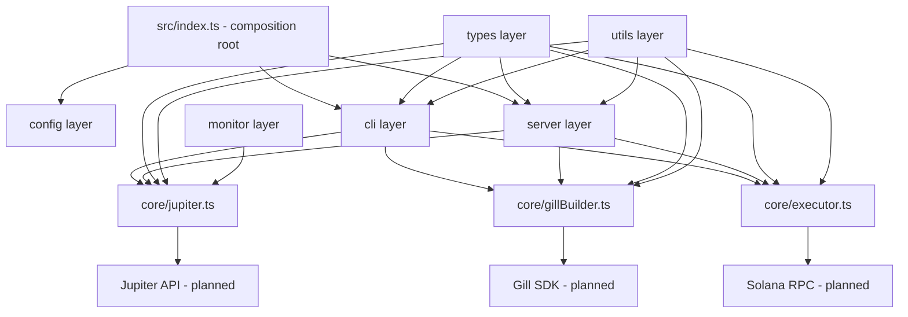

# gill-swap

Backend-only TypeScript Node.js scaffold for a Solana swap automation engine.

This project is intentionally boilerplate-first and production-oriented in structure. It uses:

- Gill SDK as the planned on-chain transaction builder/signing stack (placeholder integration points included)
- Jupiter Aggregator as the planned quote + swap-instruction provider (placeholder integration points included)
- Commander for CLI usage
- Fastify for a lightweight HTTP API

No frontend code is included.

## Features

- Clean layered architecture (`config`, `core`, `types`, `utils`, `cli`, `server`, `monitor`)
- Strict TypeScript setup for backend services
- Zod-validated environment configuration
- Structured Winston logging
- Reusable retry utility for send/confirm pipelines
- CLI commands for `swap` and `dca` (placeholder behavior)
- Optional Fastify HTTP server mode

## Project Structure

```text
.
├── src/
│   ├── config/
│   │   ├── index.ts
│   │   └── schema.ts
│   ├── core/
│   │   ├── jupiter.ts
│   │   ├── gillBuilder.ts
│   │   └── executor.ts
│   ├── types/
│   │   └── index.ts
│   ├── utils/
│   │   ├── logger.ts
│   │   ├── retry.ts
│   │   └── helpers.ts
│   ├── cli/
│   │   ├── index.ts
│   │   └── commands/
│   │       ├── swap.ts
│   │       └── dca.ts
│   ├── server/
│   │   └── index.ts
│   ├── monitor/
│   │   └── priceMonitor.ts
│   └── index.ts
├── config/
│   └── default.json
├── .env.example
├── .env
├── package.json
├── tsconfig.json
├── README.md
├── .gitignore
└── .eslintrc.json
```

## Architecture Overview



## Getting Started

### 1) Install dependencies (pnpm only)

```bash
pnpm install
```

### 2) Configure environment

Update `.env` as needed (placeholder defaults are included).

### 3) Build

```bash
pnpm build
```

### 4) Run in server mode

```bash
pnpm dev
```

Or compiled mode:

```bash
pnpm build
pnpm start
```

### 5) Run CLI commands

Swap command:

```bash
pnpm swap -- --inputMint So11111111111111111111111111111111111111112 \
  --outputMint EPjFWdd5AufqSSqeM2qN1xzybapC8G4wEGGkZwyTDt1v \
  --amountAtomic 1000000 \
  --userPublicKey ExamplePublicKey11111111111111111111111111111111
```

DCA command (single run):

```bash
pnpm dca -- --inputMint So11111111111111111111111111111111111111112 \
  --outputMint EPjFWdd5AufqSSqeM2qN1xzybapC8G4wEGGkZwyTDt1v \
  --amountAtomic 1000000 \
  --userPublicKey ExamplePublicKey11111111111111111111111111111111 \
  --runOnce
```

## HTTP Endpoints

- `GET /health`
- `POST /api/v1/swap` (placeholder pipeline)
- `POST /api/v1/dca` (not implemented placeholder)

## Notes

- Real Jupiter HTTP calls are intentionally not implemented yet.
- Real Gill SDK transaction assembly/signing is intentionally not implemented yet.
- Real Solana send/confirm lifecycle is intentionally not implemented yet.
- Search for `TODO:` markers in `src/core` and `src/monitor` for integration points.