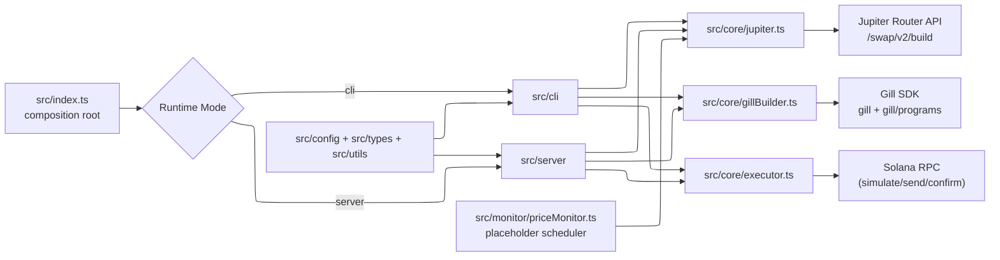
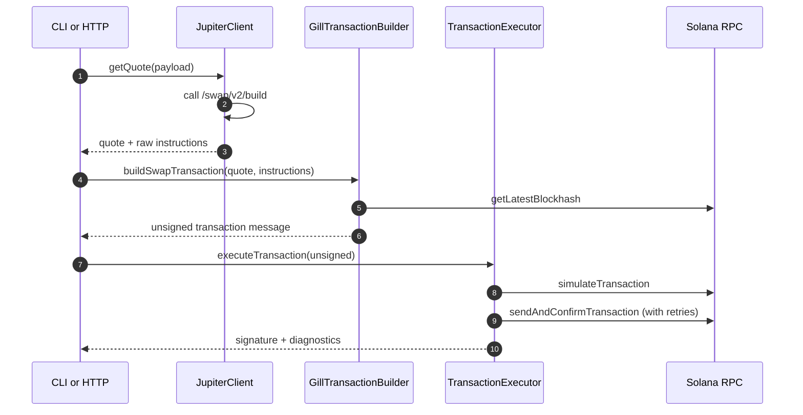

# gill-swap

Backend-only TypeScript Node.js service for Solana swap automation using Jupiter Router + Gill.

The project supports two runtime modes:

- CLI mode for one-off swaps and scheduled DCA runs
- Server mode with Fastify API endpoints

## Current Status

Implemented now:

- Real Jupiter Router build requests via `GET /swap/v2/build`
- Real conversion of Jupiter raw instructions into Gill transaction instructions
- Real transaction execution lifecycle: simulate -> sign -> send+confirm with retry/backoff
- Zod-validated config and request payloads
- Jest test suite for `jupiter`, `gillBuilder`, and `executor`

Not fully implemented yet:

- HTTP DCA endpoint (`POST /api/v1/dca` returns `501`)
- Price monitor logic (scheduler skeleton exists in `src/monitor/priceMonitor.ts`)

## Architecture



### Swap Execution Flow



## Setup

### 1) Install

```bash
pnpm install
```

### 2) Configure environment

Create or update `.env`.

Important variables:

- `SOLANA_RPC_URL` (required)
- `HOT_WALLET_PATH` (required)
- `JUPITER_API_KEY` (required at runtime by `JupiterClient`)
- `JUPITER_API_BASE_URL` (default: `https://quote-api.jup.ag/v6`)
- `DEFAULT_SLIPPAGE_BPS` (default: `50`)
- `PRIORITY_FEE_MICROLAMPORTS` (default: `0`)
- `MAX_RETRIES` (default: `3`)
- `RETRY_BASE_DELAY_MS` (default: `350`)
- `REQUEST_TIMEOUT_MS` (default: `10000`)
- `APP_MODE` (`cli` or `server`, default: `cli`)
- `HOST`/`PORT` (default: `0.0.0.0:3000`)

### 3) Build

```bash
pnpm build
```

## Running the Project

### Server Mode

```bash
pnpm dev
```

or:

```bash
pnpm server
```

Compiled run:

```bash
pnpm build
pnpm start
```

### API Docs (Scalar)

When the server is running, open:

- `/docs` for the Scalar API reference UI (served by `@scalar/fastify-api-reference`)
- `/openapi.json` for the OpenAPI document consumed by Scalar

### CLI: Swap

The swap command accepts token symbols (`SOL`, `WSOL`, `USDC`, `USDT`) or raw mint addresses.

UI amount mode:

```bash
pnpm swap -- \
  --input USDC \
  --output SOL \
  --amount 5 \
  --userPublicKey <YOUR_PUBLIC_KEY>
```

Atomic amount mode:

```bash
pnpm swap -- \
  --input EPjFWdd5AufqSSqeM2qN1xzybapC8G4wEGGkZwyTDt1v \
  --output So11111111111111111111111111111111111111112 \
  --amount 0 \
  --amountAtomic 5000000 \
  --userPublicKey <YOUR_PUBLIC_KEY>
```

Notes:

- If `--userPublicKey` is omitted, the CLI loads signer from `HOT_WALLET_PATH` and uses that address.
- When using raw mint + UI amount, provide `--inputDecimals` or use `--amountAtomic`.

### CLI: DCA

Single execution:

```bash
pnpm dca -- \
  --inputMint So11111111111111111111111111111111111111112 \
  --outputMint EPjFWdd5AufqSSqeM2qN1xzybapC8G4wEGGkZwyTDt1v \
  --amountAtomic 1000000 \
  --userPublicKey <YOUR_PUBLIC_KEY> \
  --runOnce
```

Scheduled execution:

```bash
pnpm dca -- \
  --inputMint So11111111111111111111111111111111111111112 \
  --outputMint EPjFWdd5AufqSSqeM2qN1xzybapC8G4wEGGkZwyTDt1v \
  --amountAtomic 1000000 \
  --userPublicKey <YOUR_PUBLIC_KEY> \
  --every "*/30 * * * * *" \
  --maxRuns 10
```

## Operational Notes

- On-chain swaps can fail due to runtime conditions such as insufficient wallet funds, slippage, or transient RPC issues.
- Executor retry behavior is controlled by `MAX_RETRIES` and `RETRY_BASE_DELAY_MS`.
- `TransactionExecutor` enforces signer safety: wallet signer address must match quote taker address.